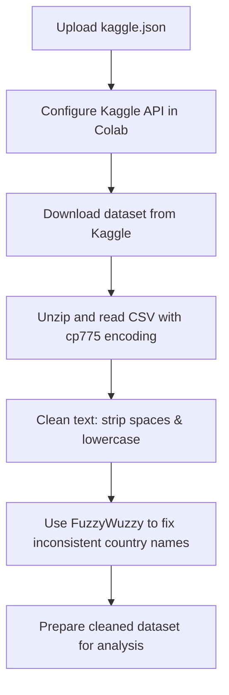

# 🧹 Cleaning and Analyzing Pakistan Intellectual Capital Dataset

This project demonstrates how to download, preprocess, and clean the **Pakistan Intellectual Capital – Computer Science** dataset from Kaggle.  
The workflow covers:
- Setting up Kaggle API in Google Colab
- Downloading the dataset
- Handling file encoding issues
- Cleaning and standardizing country names using **FuzzyWuzzy**
- Preparing the data for analysis

---

## 📂 Dataset
- **Source:** [Pakistan Intellectual Capital – Computer Science – Ver 1](https://www.kaggle.com/datasets/zusmani/pakistanintellectualcapitalcs)
- **Format:** CSV
- **Content:** Information about computer science faculty in Pakistan, including:
  - Teacher Name
  - University
  - Department
  - Country of graduation
  - Area of specialization

---

## 📊 Workflow Overview

## 📦 Requirements

- Python `3.x` — programming language
- `pandas` — data manipulation
- `numpy` — numerical computing
- `scikit-learn` — machine learning
- `fuzzywuzzy` — string matching
- `tensorflow` — deep learning framework
- Kaggle API key file: `kaggle.json`

